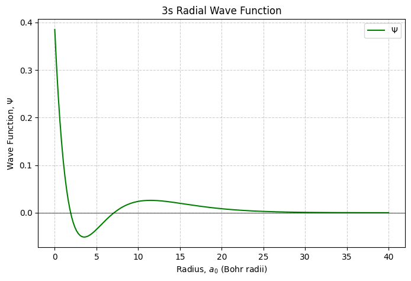
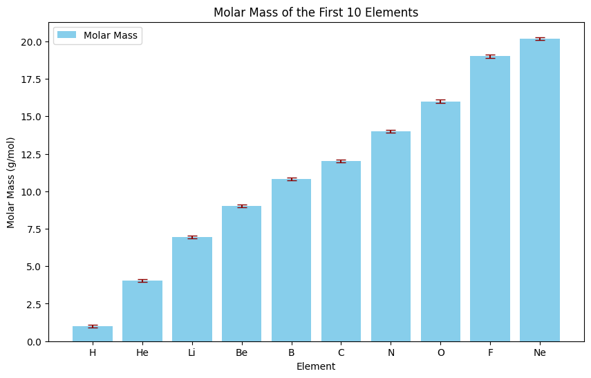
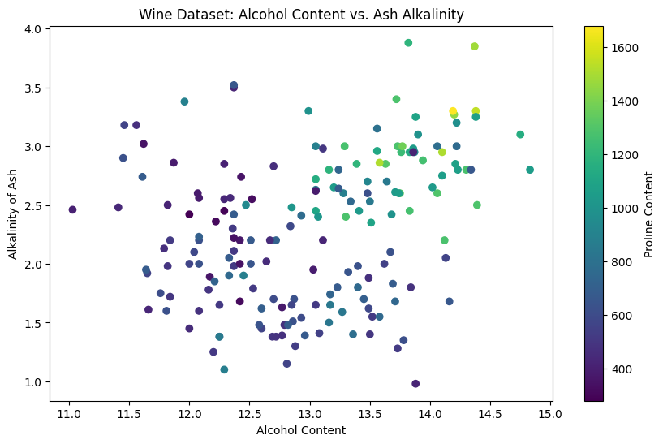
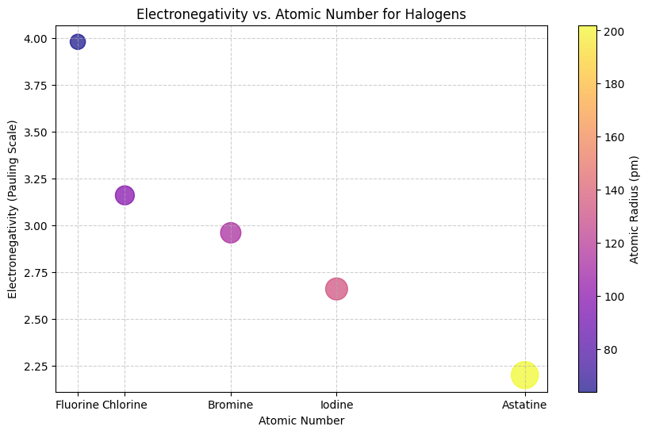

# chemical_data_visualozation.py
A collection of Python scripts demonstrating various data visualization techniques for chemical and scientific data using Matplotlib
# Data Visualization for Chemistry using Matplotlib

This repository contains a collection of Python scripts demonstrating various data visualization techniques for chemical and scientific data using the `matplotlib` library. The goal is to create publication-quality plots that clearly communicate trends and insights.

---

### 1. Visualizing Quantum Mechanical Wavefunctions

This script plots the 3s radial wave function ($\Psi$) for a hydrogen-like atom as a function of radius. This type of visualization is fundamental in physical and computational chemistry to understand atomic structure.

---

### 2. Plotting Periodic Trends with Uncertainty

This example uses a bar plot with error bars to visualize the molar mass of the first 10 elements. Adding error bars is a critical skill for accurately representing experimental data.

---

### 3. Multidimensional Data Exploration with Scatter Plots

This scatter plot visualizes multiple properties of different wines from the `scikit-learn` dataset. It plots alcohol content vs. alkalinity, while using color to represent a third variable (proline content), demonstrating how to represent multi-dimensional data in 2D.

---

### 4. Advanced Scatter Plot: Periodic Properties of Halogens

This plot shows a more advanced visualization, conveying four dimensions of data in a single chart:
- **X-axis:** Atomic Number
- **Y-axis:** Electronegativity
- **Marker Size:** Atomic Radius
- **Marker Color:** Atomic Radius

This is a powerful way to show complex relationships between different physical properties of elements.

